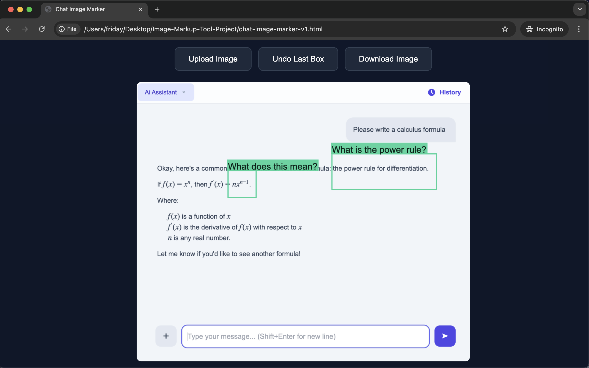

# Chat-Image-Marker

 

A minimalist desktop web based tool to quickly mark up images with bounding boxes and labels when chatting with a multimodal Ai model. Works offline. Double-click to launch. 

For a quick back-and-forth chat, a simple tool means less friction.

Created for students who use Ai as a tutor - both online and offline. 

 

## How to run the app

 

- Download the project folder
- Place it on your desktop
- Double-click the file to launch
- The app will open in your browser
- Drop in your image
- Click and drag to draw a bounding box
- Type in a label

 

## A Privacy-First Tool

This tool is a standalone, offline application that simply runs inside your web browser. Your files and data remain completely under your control. No data leaves your machine. You can switch off your internet connection for added security.

 
 

Chat Image Marker- Sample marked-up chat screenshot

 

## App Family - Offline-First, Privacy-First

- myOfflineAi-PrivacyFirst (Maximum security. No chat history is saved.) 
  https://github.com/vbookshelf/myOfflineAi-PrivacyFirst 
- myOfflineAi-ChatHistory (Saves chats to a local file you control.) 
  https://github.com/vbookshelf/myOfflineAi-ChatHistory 
- Chat-Image-Marker (A simple, offline tool for marking up images.) 
  https://github.com/vbookshelf/Chat-Image-Marker 

 
 
